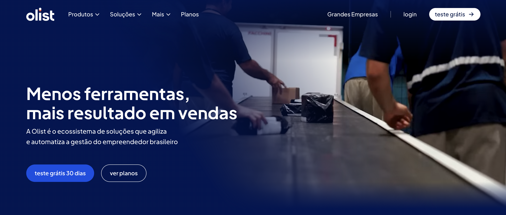

# OList-ecommerce
Conducting a business analysis on brazilian website Olist.

## 📌 Résumé du Projet
Analysing the brazilan ecommerce website Olist to get a better understanding on dominant product categories, payment methods, and evaluate the immpact of delivery delays on customer review.

---

## 🛠️ Stack Technique
* **Analyse & Nettoyage :** Python (Pandas, Numpy) via Google Colab
* **Visualisation :** Python (Plotly)
* **Source des données :** [[Link](https://www.kaggle.com/datasets/olistbr/brazilian-ecommerce)]

* Open in colab : 
---

## 📊 Méthodologie & Étapes
1.  **Cleaning (Notebook) :** Nettoyage des données.
2.  **Traitement (Notebook) :** Analyse exploratoire (EDA), gestion des valeurs manquantes et calcul des KPIs (Mean order price, Median order, Standard Deviation, Distribution).
3.  **Visualisation (Notebook) :** Création de graphiques pour illustrer la distribution, le top 20 product categories, et les payment methodes préférés des clients.
4.  **Statistical Analysis** : Hypothesis testing on the impact of delivery delays on customer reviews (AB testing). Visualisation & Interpretation.

---

## 📂 Structure du Repo
* `/Notebook` : Le notebook `.ipynb` détaillé (Colab).
* `/assets` : Captures d'écran et graphiques.

---

## 📬 Contact
[[Vincent Henrion](https://www.linkedin.com/in/vincent-henrion/)]
